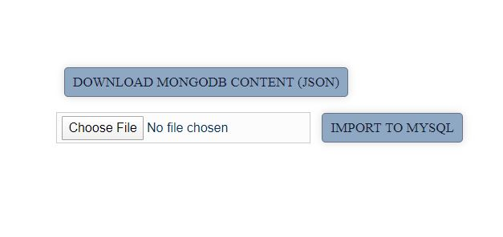
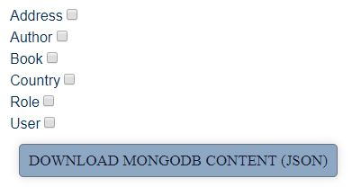

Interactions between MongoDB and MySQL in Grails/Groovy 
=======================================================
**version 1.0.0**  
You can import your json files dynamically into MySQL database
using dynamic domain calls. You can also get all properties
of MongoDB with downloading a json file.

Configuration
---
Artifact | Version |
--- | --- | 
Grails | 2.5.6 |
MongoDB | 5.0.8.RELEASE |
MySQL | 5.1.29 |
Hibernate | 4:5.0.8.RELEASE |


Main functionalities
--------------------
1. Upload *.json file
2. Download *.json file
3. Import to MySQL
4. Export from MongoDB
---
Install and run
---
To build Grails, clone this GitHub repository and execute the install Gradle target:
```
git clone https://github.com/hamidfarmani/IMM.git
cd IMM
grails run-app
```
Usage
---

### Sample *.Json  
To import your data into MySQL database, your json file should look
like the below sample:
```
{
	"Book":[
		{
			"author":"F Scott Fitzgerald",
			"title":"The Great Gatsby"
		},
		{
			"author":"J.K Rowling",
			"title":"Harry Potter"
		}
	]
}
```  
### Initialize MongoDB  
In order to save mock data to MongoDB, you can call the provided 
method which is:
[/IMM/file/saveToMongo](http://localhost:8090/IMM/file/saveToMongo)
This allows you to have some data in your MongoDB.  



### Import to MySQL  
Choose your json file which is like the mentioned example and click 
on `Import To MySQL` button.


### Download MongoDB Content  
  

This allows you to download the content that you want from MongoDB
 and get its json file. The download will start automatically 
 after you checked the domains that you want and then the download 
 button.  
 

About
---


### Author  
Hamid Farmani

* [github/hamidfarmani](https://github.com/hamidfarmani)
* [hamidfarmani1@gmail.com](mailto:hamidfarmani1@gmail.com?subject=[GitHub]%20IMM)


### License  
Copyright © 2020, NeoVision.am


